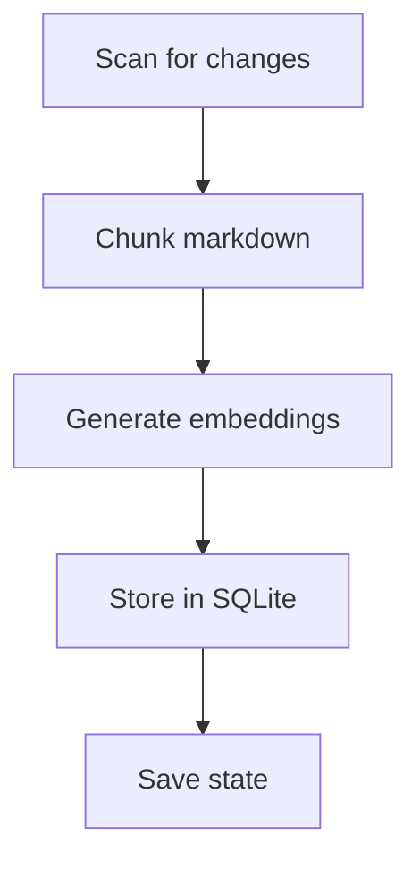
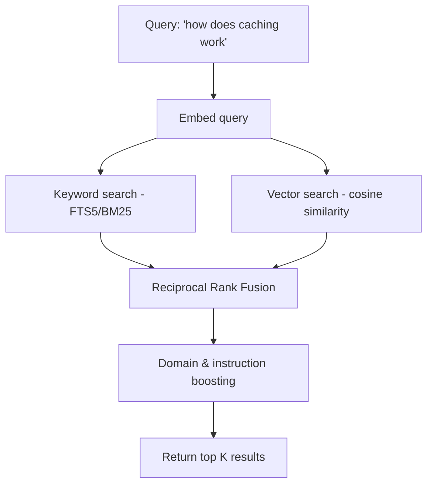

# How MemoryExchange Works

MemoryExchange turns a folder of markdown files into a searchable knowledge base that AI coding assistants (GitHub Copilot, Cline, etc.) can query in real time via the [Model Context Protocol (MCP)](https://modelcontextprotocol.io/).

The core idea: your project's architectural docs, conventions, and decisions should be instantly available to AI — not buried in files it may never open.

---

## The Two Phases

MemoryExchange has two phases: **indexing** (prepare the docs) and **searching** (answer queries). When you start the MCP server with `--build-index`, both happen automatically — indexing runs first, then the server starts listening for search requests.


---

## Phase 1: Indexing

Indexing reads your markdown files, breaks them into searchable pieces, and stores them with their vector embeddings. It runs incrementally — only changed files are reprocessed.



### Step 1: Scan for Changes

Every file gets a SHA-256 content hash. These hashes are saved to a state file (`.memory-exchange-state.json`) after each run. On the next run, the scanner compares current hashes against saved ones to find:

- **New/modified files** — hash is missing or different
- **Deleted files** — hash exists in state but the file is gone

This means re-indexing a 200-file source directory after changing one file only reprocesses that one file.

### Step 2: Chunk the Markdown

Full documents are too large to embed meaningfully — a single vector can't capture everything in a 5-page doc. So each file is split into **chunks** of roughly 500 tokens (~2,000 characters).

The chunker is heading-aware:

1. **Split by headings** — each `#`, `##`, `###` section becomes a candidate chunk. A breadcrumb like `"Architecture > Caching > Redis Setup"` is preserved so the chunk carries its context even in isolation.

2. **Keep code blocks atomic** — a code block is never split across chunks. It stays with its preceding paragraph so the explanation and the code travel together.

3. **Discard fragments** — chunks under 100 characters are dropped to avoid noise from stubs like empty sections.

**Example:** A file `architecture.md` with sections "Overview", "Caching", and "Deployment" produces three separate chunks, each tagged with its heading path and source file.

### Step 3: Generate Embeddings

Each chunk's text is converted into a **384-dimensional vector** (an "embedding") using the `all-MiniLM-L6-v2` model, running locally via ONNX Runtime — no API calls, no cloud dependency.

An embedding is a list of 384 numbers that captures the *meaning* of the text. Texts about similar topics produce vectors that point in similar directions. This is what makes semantic search possible — you can find relevant content even when the exact keywords don't match.

The embedding pipeline:

1. **Tokenize** — split text into subword tokens using WordPiece (the same tokenizer BERT uses)
2. **Run inference** — feed tokens through the neural network (CPU-only, ~10ms per chunk)
3. **Mean pool** — average all token vectors into one chunk-level vector
4. **L2 normalize** — scale the vector to unit length, so cosine similarity becomes a simple dot product

### Step 4: Store Everything

Each chunk is stored in a SQLite database with:

| What | Why |
|------|-----|
| **Text content** | Returned in search results |
| **Embedding (BLOB)** | Used for semantic similarity search |
| **FTS5 index** | Used for keyword search |
| **Source file path** | Shown in results so the AI knows where info came from |
| **Heading breadcrumb** | Provides section context (e.g., `"Architecture > Caching"`) |
| **Domain tag** | Enables domain-aware boosting at query time |
| **Instruction flag** | Marks chunks from `.instructions.md` files for priority boosting |

[FTS5](https://www.sqlite.org/fts5.html) is SQLite's full-text search engine. It builds an inverted index over the chunk text, enabling fast keyword lookups with BM25 relevance scoring — similar to how a search engine works, but embedded in the database.

The database uses [WAL mode](https://www.sqlite.org/wal.html) so the MCP server can read while the indexer writes, without locking.

---

## Phase 2: Searching

When the AI assistant calls `search_memory_exchange`, the query goes through a hybrid search pipeline that combines keyword matching with semantic understanding.



### Why Hybrid Search?

Neither keyword search nor semantic search is sufficient alone:

| Approach | Strength | Weakness |
|----------|----------|----------|
| **Keyword (BM25)** | Exact term matching — great for specific names like `PolicyController` | Misses synonyms and related concepts |
| **Semantic (vector)** | Understands meaning — "caching strategy" finds "Redis TTL configuration" | Can miss exact terms, especially code identifiers |

Combining both gives high recall (finds relevant content) with high precision (ranks it well).

### Step 1: Embed the Query

The same embedding model used during indexing converts the search query into a 384-dimensional vector. Using the same model ensures the query vector lives in the same space as the stored chunk vectors — so distances between them are meaningful.

### Step 2: Keyword Search (FTS5 + BM25)

The query is run against the [FTS5](https://www.sqlite.org/fts5.html) full-text index. FTS5 is SQLite's built-in full-text search engine — think of it as a lightweight Elasticsearch embedded directly in the database file. Under the hood, it maintains an **inverted index**: a mapping from every word to the list of chunks that contain it. This makes keyword lookups O(1) per term instead of scanning every chunk.

FTS5 ranks matches using [BM25](https://en.wikipedia.org/wiki/Okapi_BM25) (Best Matching 25), the same family of ranking functions used by Elasticsearch, Lucene, and most production search engines. BM25 is built on two intuitions:

- **TF (Term Frequency)** — if a word appears more often in a chunk, that chunk is probably more relevant to that word. But the relationship is sublinear: the first occurrence matters a lot, the tenth barely moves the score. BM25 models this with a saturation curve controlled by parameter `k1` (typically 1.2), so relevance doesn't scale linearly with word count.

- **IDF (Inverse Document Frequency)** — rare words are more informative than common ones. If `"PolicyController"` appears in only 2 out of 500 chunks, it's a strong signal. If `"the"` appears in all 500, it tells us nothing. IDF is computed as `log((N - n + 0.5) / (n + 0.5))` where `N` is the total number of chunks and `n` is how many contain the term.

BM25 also normalizes by **document length** — a short chunk that mentions `"caching"` three times is probably more focused on caching than a long chunk that mentions it three times among 200 other words. Parameter `b` (typically 0.75) controls how much document length affects the score.

The combined formula for a single term in a single chunk:

```
BM25(term, chunk) = IDF(term) × (TF × (k1 + 1)) / (TF + k1 × (1 - b + b × chunkLen/avgChunkLen))
```

For multi-word queries, the scores for each term are summed. SQLite's `bm25()` function handles all of this internally — MemoryExchange simply calls `SELECT ... FROM chunks_fts WHERE chunks_fts MATCH @query ORDER BY bm25(chunks_fts)` and gets back chunks ranked by relevance.

For example, querying `"caching strategy"` will score chunks higher if they contain both words, especially if those words are rare across the corpus. A chunk titled "Redis Caching Strategy" in a corpus where most chunks discuss API design will rank very high because both terms have high IDF.

### Step 3: Vector Search (Cosine Similarity)

The query embedding is compared against every stored chunk embedding using **cosine similarity**. This finds chunks that are *semantically* similar even without shared keywords.

Cosine similarity measures the angle between two vectors — if they point in the same direction, the text is semantically similar, regardless of whether they share any words. Two vectors pointing in exactly the same direction have a cosine similarity of 1.0; perpendicular vectors score 0.0.

The general formula is:

```
cosine_similarity(A, B) = (A · B) / (‖A‖ × ‖B‖)
```

where `A · B` is the dot product (sum of element-wise products) and `‖A‖` is the vector's magnitude (L2 norm). However, since MemoryExchange L2-normalizes all embeddings during indexing (step 3 above), every vector already has magnitude 1.0. This means the denominator is always `1 × 1 = 1`, and cosine similarity collapses to just the **dot product**:

```csharp
float dot = 0;
for (int i = 0; i < 384; i++)
    dot += queryEmbedding[i] * chunkEmbedding[i];
// dot IS the cosine similarity — no division needed
```

This is a deliberate optimization: by normalizing once at index time, every query-time comparison saves a square root and a division. Over hundreds of chunks per query, this adds up.

The search is a **brute-force linear scan** — every chunk's embedding is loaded from SQLite and compared against the query. This is fast enough for knowledge bases of the size MemoryExchange targets (hundreds to low thousands of chunks). The scan runs in-process with no network overhead, and 384-dimensional dot products are cheap on modern CPUs.

For example, a query about `"how data is cached"` will match a chunk about `"Redis TTL and eviction policies"` because the model understands these concepts are related — even though the two texts share zero keywords.

### Step 4: Reciprocal Rank Fusion (RRF)

The two ranked lists are merged using [Reciprocal Rank Fusion](https://plg.uwaterloo.ca/~gvcormac/cormacksigir09-rrf.pdf):

```
score(chunk) = 1/(k + rank_keyword) + 1/(k + rank_vector)
```

**Why not just combine the raw scores?** BM25 and cosine similarity produce scores on completely different scales. SQLite's `bm25()` returns *negative* values (lower is better, typically -5 to 0), while cosine similarity returns values between 0 and 1 (higher is better). You can't average or sum these meaningfully — a BM25 score of -2.3 and a cosine score of 0.87 aren't comparable. Normalizing them (e.g., min-max scaling) is fragile because the ranges shift depending on the query and corpus.

RRF sidesteps all of this by ignoring the scores entirely and working only with **rank positions**. It doesn't matter *how much* better chunk A scored than chunk B in keyword search — only that A was ranked higher. This makes the merge stable across different queries, corpus sizes, and scoring functions.

**What k=60 controls.** The constant `k` (set to 60 in MemoryExchange) is a smoothing parameter that dampens the advantage of top-ranked items. Consider the difference between rank 1 and rank 2:

- With `k=1`: scores are `1/2 = 0.500` vs `1/3 = 0.333` — a 50% gap
- With `k=60`: scores are `1/61 = 0.01639` vs `1/62 = 0.01613` — a 1.6% gap

A higher `k` means the top ranks don't dominate as aggressively, giving more weight to agreement between the two systems rather than absolute position in either one. The value 60 comes from the [original RRF paper](https://plg.uwaterloo.ca/~gvcormac/cormacksigir09-rrf.pdf) and is widely used as a default.

**How the merge works.** The implementation iterates through both ranked lists, computing an RRF contribution for each chunk in each list. If a chunk appears in both lists, its contributions are summed. If it appears in only one, it gets only that single contribution — roughly half the score of a chunk that appears in both.

Here's a worked example with four chunks:

| Chunk | Keyword rank | Vector rank | Keyword RRF | Vector RRF | **Total RRF** |
|-------|-------------|-------------|-------------|------------|---------------|
| "Redis TTL policies" | #1 | #2 | 1/61 = 0.01639 | 1/62 = 0.01613 | **0.03252** |
| "Cache invalidation" | #3 | #1 | 1/63 = 0.01587 | 1/61 = 0.01639 | **0.03226** |
| "Redis connection config" | #2 | — | 1/62 = 0.01613 | 0 | **0.01613** |
| "Eviction strategies" | — | #3 | 0 | 1/63 = 0.01587 | **0.01587** |

The first two chunks rank highest because *both* systems agree they're relevant. "Redis connection config" matched keywords (it contains "Redis") but wasn't semantically related to the query, so it drops to third. "Eviction strategies" was semantically close but lacked keyword overlap, so it comes last. A chunk appearing in both lists will always outscore a chunk appearing in only one — this is the core property that makes RRF effective for hybrid search.

### Step 5: Domain & Instruction Boosting

If the AI tells us which file the user is editing (e.g., `src/Caching/RedisClient.cs`), we can boost results from the matching domain:

- **Domain boost (1.3x)** — chunks from the same area of the knowledge base as the code being edited are multiplied by 1.3
- **Instruction boost (1.2x)** — chunks from `.instructions.md` files (project conventions, coding standards) are multiplied by 1.2

These stack: a matching instruction file gets `1.3 × 1.2 = 1.56x` its original score.

After boosting, results are re-sorted and trimmed to the requested count (default 5, max 10).

---

## Azure Provider

For larger teams or cloud deployments, MemoryExchange can use **Azure AI Search** + **Azure OpenAI** instead of the local SQLite + ONNX stack. The search pipeline is identical (hybrid search, RRF, boosting) — only the storage and embedding backends change. Azure AI Search handles BM25 and vector search natively at scale.

---

## At a Glance

| Component | What | Why |
|-----------|------|-----|
| SHA-256 scanning | Detect changed files | Incremental indexing — don't redo work |
| Heading-aware chunking | Split docs into ~500-token pieces | Small enough for meaningful embeddings, large enough for context |
| all-MiniLM-L6-v2 | Generate 384-dim embeddings | Fast, accurate, runs locally on CPU |
| SQLite + FTS5 | Store chunks and keyword index | Zero infrastructure, portable, fast |
| BM25 keyword search | Find exact term matches | Catches specific names, identifiers, paths |
| Cosine similarity | Find semantically similar content | Catches related concepts even without shared words |
| Reciprocal Rank Fusion | Merge two ranked lists | Score-agnostic merging that rewards agreement |
| Domain boosting | Prioritize relevant context | The AI gets docs about what you're actually working on |
| MCP server | Expose search as a tool | Any MCP-compatible AI assistant can use it |
