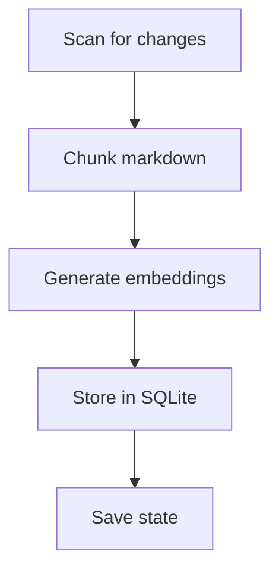
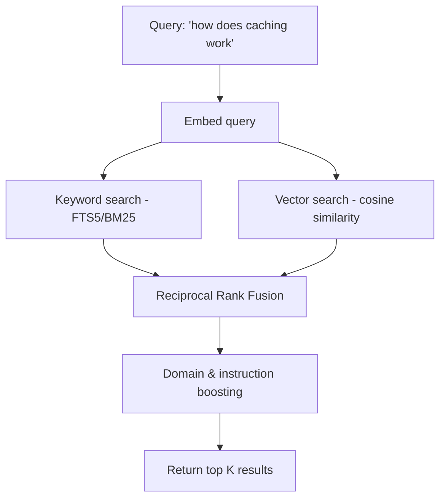

# How MemoryExchange Works

MemoryExchange turns a folder of markdown files into a searchable knowledge base that AI coding assistants (GitHub Copilot, Cline, etc.) can query in real time via the [Model Context Protocol (MCP)](https://modelcontextprotocol.io/).

The core idea: your project's architectural docs, conventions, and decisions should be instantly available to AI — not buried in files it may never open.

---

## The Two Phases

MemoryExchange has two phases: **indexing** (prepare the docs) and **searching** (answer queries). When you start the MCP server with `--build-index`, both happen automatically — indexing runs first, then the server starts listening for search requests.


---

## Phase 1: Indexing

Indexing reads your markdown files, breaks them into searchable pieces, and stores them with their vector embeddings. It runs incrementally — only changed files are reprocessed.



### Step 1: Scan for Changes

Every file gets a SHA-256 content hash. These hashes are saved to a state file (`.memory-exchange-state.json`) after each run. On the next run, the scanner compares current hashes against saved ones to find:

- **New/modified files** — hash is missing or different
- **Deleted files** — hash exists in state but the file is gone

This means re-indexing a 200-file source directory after changing one file only reprocesses that one file.

### Step 2: Chunk the Markdown

Full documents are too large to embed meaningfully — a single vector can't capture everything in a 5-page doc. So each file is split into **chunks** of roughly 500 tokens (~2,000 characters).

The chunker is heading-aware:

1. **Split by headings** — each `#`, `##`, `###` section becomes a candidate chunk. A breadcrumb like `"Architecture > Caching > Redis Setup"` is preserved so the chunk carries its context even in isolation.

2. **Keep code blocks atomic** — a code block is never split across chunks. It stays with its preceding paragraph so the explanation and the code travel together.

3. **Discard fragments** — chunks under 100 characters are dropped to avoid noise from stubs like empty sections.

**Example:** A file `architecture.md` with sections "Overview", "Caching", and "Deployment" produces three separate chunks, each tagged with its heading path and source file.

### Step 3: Generate Embeddings

Each chunk's text is converted into a **384-dimensional vector** (an "embedding") using the `all-MiniLM-L6-v2` model, running locally via ONNX Runtime — no API calls, no cloud dependency.

An embedding is a list of 384 numbers that captures the *meaning* of the text. Texts about similar topics produce vectors that point in similar directions. This is what makes semantic search possible — you can find relevant content even when the exact keywords don't match.

The embedding pipeline:

1. **Tokenize** — split text into subword tokens using WordPiece (the same tokenizer BERT uses)
2. **Run inference** — feed tokens through the neural network (CPU-only, ~10ms per chunk)
3. **Mean pool** — average all token vectors into one chunk-level vector
4. **L2 normalize** — scale the vector to unit length, so cosine similarity becomes a simple dot product

### Step 4: Store Everything

Each chunk is stored in a SQLite database with:

| What | Why |
|------|-----|
| **Text content** | Returned in search results |
| **Embedding (BLOB)** | Used for semantic similarity search |
| **FTS5 index** | Used for keyword search |
| **Source file path** | Shown in results so the AI knows where info came from |
| **Heading breadcrumb** | Provides section context (e.g., `"Architecture > Caching"`) |
| **Domain tag** | Enables domain-aware boosting at query time |
| **Instruction flag** | Marks chunks from `.instructions.md` files for priority boosting |

[FTS5](https://www.sqlite.org/fts5.html) is SQLite's full-text search engine. It builds an inverted index over the chunk text, enabling fast keyword lookups with BM25 relevance scoring — similar to how a search engine works, but embedded in the database.

The database uses [WAL mode](https://www.sqlite.org/wal.html) so the MCP server can read while the indexer writes, without locking.

---

## Phase 2: Searching

When the AI assistant calls `search_memory_exchange`, the query goes through a hybrid search pipeline that combines keyword matching with semantic understanding.



### Why Hybrid Search?

Neither keyword search nor semantic search is sufficient alone:

| Approach | Strength | Weakness |
|----------|----------|----------|
| **Keyword (BM25)** | Exact term matching — great for specific names like `PolicyController` | Misses synonyms and related concepts |
| **Semantic (vector)** | Understands meaning — "caching strategy" finds "Redis TTL configuration" | Can miss exact terms, especially code identifiers |

Combining both gives high recall (finds relevant content) with high precision (ranks it well).

### Step 1: Embed the Query

The same embedding model used during indexing converts the search query into a 384-dimensional vector. Using the same model ensures the query vector lives in the same space as the stored chunk vectors — so distances between them are meaningful.

### Step 2: Keyword Search (BM25)

The query is run against the FTS5 index. [BM25](https://en.wikipedia.org/wiki/Okapi_BM25) is a ranking function that scores documents based on term frequency, inverse document frequency, and document length — the standard algorithm behind most search engines.

For example, querying `"caching strategy"` will score chunks higher if they contain both words, especially if those words are rare across the corpus.

### Step 3: Vector Search (Cosine Similarity)

The query embedding is compared against every stored chunk embedding using cosine similarity (dot product on normalized vectors). This finds chunks that are *semantically* similar even without shared keywords.

For example, a query about `"how data is cached"` will match a chunk about `"Redis TTL and eviction policies"` because the model understands these concepts are related.

### Step 4: Reciprocal Rank Fusion (RRF)

The two ranked lists are merged using [Reciprocal Rank Fusion](https://plg.uwaterloo.ca/~gvcormac/cormacksigir09-rrf.pdf) with k=60:

```
score(chunk) = 1/(60 + rank_keyword) + 1/(60 + rank_vector)
```

RRF is elegant because it doesn't care about the raw scores from each system (which are on different scales) — it only uses **rank positions**. A chunk ranked #1 in both lists gets `1/61 + 1/61 = 0.0328`. A chunk ranked #1 in keywords but absent from vector results gets only `1/61 = 0.0164`. This naturally rewards chunks that both systems agree are relevant.

### Step 5: Domain & Instruction Boosting

If the AI tells us which file the user is editing (e.g., `src/Caching/RedisClient.cs`), we can boost results from the matching domain:

- **Domain boost (1.3x)** — chunks from the same area of the knowledge base as the code being edited are multiplied by 1.3
- **Instruction boost (1.2x)** — chunks from `.instructions.md` files (project conventions, coding standards) are multiplied by 1.2

These stack: a matching instruction file gets `1.3 × 1.2 = 1.56x` its original score.

After boosting, results are re-sorted and trimmed to the requested count (default 5, max 10).

---

## Azure Provider

For larger teams or cloud deployments, MemoryExchange can use **Azure AI Search** + **Azure OpenAI** instead of the local SQLite + ONNX stack. The search pipeline is identical (hybrid search, RRF, boosting) — only the storage and embedding backends change. Azure AI Search handles BM25 and vector search natively at scale.

---

## At a Glance

| Component | What | Why |
|-----------|------|-----|
| SHA-256 scanning | Detect changed files | Incremental indexing — don't redo work |
| Heading-aware chunking | Split docs into ~500-token pieces | Small enough for meaningful embeddings, large enough for context |
| all-MiniLM-L6-v2 | Generate 384-dim embeddings | Fast, accurate, runs locally on CPU |
| SQLite + FTS5 | Store chunks and keyword index | Zero infrastructure, portable, fast |
| BM25 keyword search | Find exact term matches | Catches specific names, identifiers, paths |
| Cosine similarity | Find semantically similar content | Catches related concepts even without shared words |
| Reciprocal Rank Fusion | Merge two ranked lists | Score-agnostic merging that rewards agreement |
| Domain boosting | Prioritize relevant context | The AI gets docs about what you're actually working on |
| MCP server | Expose search as a tool | Any MCP-compatible AI assistant can use it |
